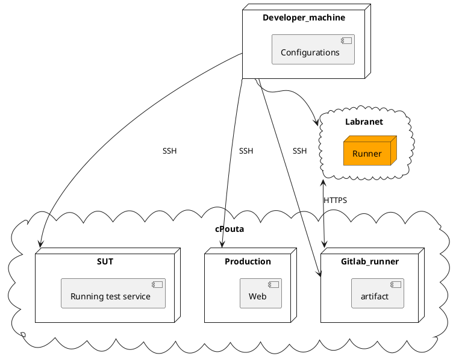

# How to set up a simple production pipeline

## Youtube Video: 
[Launching an Instance in CSC cPouta via SSH](https://www.youtube.com/watch?v=p323T41KVB0&t=143s)


This is a tutorial to set-up a Software Development Environment (SUT, Production and GitLab Runner). In this environment we have limited IP addresses, so we're creating new networks and then allowing one server, the jump server, to sit between those networks. The idea is to limit excessive use of Floating IPs therefore this Jump server will be communicating between to the Gitlab-runner server and production server. We might need Ansible Playbook to set up some configuration files on Gitlab-runner server for future management.


This is a short guide to set up a simple production pipeline which can be used as a default starting configuration.

## ENV1


What you will need?

* Working CSC-cpouta account
* CSC-project which has cPouta resources available

There are virtual machines with a certain purpose

* sut - System Under Test
* prod - Production 
* gitlab-runner - Group runner for specific project team


**Virtual Machine Specification**
```
| SUT             | Production      | Runner          |
|-----------------|-----------------|-----------------|
| node            | node            | node            |
| 3 CPU           | 2 CPU           | 3 CPU           |
| 8 GB Memory     | 4 GB Memory     | 8 GB Memory     |
| 80 GB Storage   | 80 GB Storage   | 80 GB Storage   |
| OS Ubuntu 20.04 | OS Ubuntu 20.04 | OS Ubuntu 20.04 |
```


**Virtual Machine Configuration**





### Setting Up System Under Test(SUT) Server
The system under test (SUT) is the system set aside to run a series of tests in the production pipeline. 

There are ways to handle this:
1. To write a `shell execute script` to execute during the process of the job.
2. Install the following `docker scripts` in the server.
3. Create a playbook in any directory to run a test module.

To do this, we still need to be able to log into the Test Server via `SSH`, then run the following `script`
**The shell script**
```
sudo docker rm -f $(sudo docker ps -a -q)
sudo docker build /path/to/workspace/Test -t test
sudo docker run -it -p 3000:3000 -d test
```
**Tip:** You could run an API nodejs if needed, simply create an environment that let you install `node.js`, then open the environment interface and add the command below:
```
curl -sL https://deb.nodesource.com/setup_10.x | sudo -E bash -
sudo apt-get install -y nodejs
```

**3. Basic Test Ansible**
Ansible configuration can be used in the system under test SUT, to do this, simply create a directory and give it a name **e.g.**`$ touch vars/testmodule.yml`.
Add the following to the new playbook file:
```
--- 
- 
  become: true
  hosts: all
  roles: 
    - geerlingguy.security
  tasks: 
    - 
      debug: ~
      hosts: SUT_IP_ADDRESS
      msg: "{{ testout }}"
      my_test: ~
      name: "dump test output"
      new: true
      register: testout
  vars_files: 
    - vars/testmodule.yml

```
Run the playbook and see the output `$ ansible-playbook ./testmodule.yml`. Our SUT server is ready.
You can [read](https://docs.ansible.com/ansible/latest/dev_guide/developing_modules_general.html#environment-setup) more from `Ànsible Doc`


### Jump Server / Bastion Server

A `jump host`(also known as a jump server) is an SSH gateway use in a remote network, through which a connection can be made to another host in a dissimilar security zone. 

**Dynamic Jumphost List**

The simplest way to connect to a target server via a jump host is by using `-J`flag from the command line. This signal the `SSH`to make a connection to the jump host and then establish a TCP forwarding to the target server.
```
$ ssh -J ubuntu1 ubuntu2
```

If our username and ports differ on the machines, we can specify them on the command line like this:
```
$ ssh -J sut@ubuntu: port runner@ubuntu: port
```
**For multiple Jumphosts list**
```
$ ssh -J sut@ubuntu:port,runner@ubuntu:port prod@ubuntu:port
```

However, we are going to set up a **Static Jumphost List** so to connect `Gitlab runner` through `SUT`, since we didn't assign a floating IP to the runner.
To do this, we need to add the following static jump host `routing` in `~/.ssh/config` file and specify the host.
```
vi .ssh/config
# ~/.ssh/config

Host jump
  User ubuntu
  HostName 12.345.67.89
  IdentityFile /path_to/jump/pem_file

Host remote-server
  User ubuntu
  Hostname remote.server.domain
  IdentityFile /path_to/remote/pem_file
  ForwardAgent yes
  ProxyCommand ssh jump -W %h:%p

```
### GitLab Running
The following links will help us install `Gitlab runner` on the remote server configured via `Jumphost`.
[How to install GitLab runner](https://about.gitlab.com/blog/2016/04/19/how-to-set-up-gitlab-runner-on-digitalocean/).

### Production Server
With the production server, we can run the following docker scripts to get the job done.

```
$ docker rm -f $(sudo docker ps -a -q)
$ docker build /path/to/workspace/Prod -t production
$ docker run -it -p 3000:3000 -d production
```

