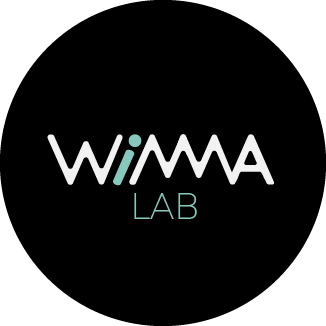
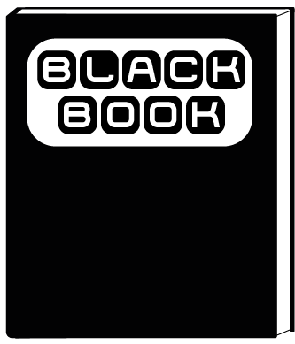
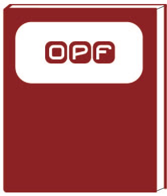

# WIMMA Lab Guides

 
[WIMMA Lab](http://www.wimmalab.org/) is a unique project-learning model launched by teacher Marko "narsu" Rintamäki at Jyväskylä University of Applied Sciences (JAMK). 
At WIMMA Lab students can practice the skills they learn at school with real assignments given by different companies and employers. Students have also the opportunity 
to learn new things, that are not necessarily taught at the school. Students are divided into different virtual companies, small and independent groups where they act as 
employees and co-operate with other virtual companies of WIMMA Lab for two and a half months. Students accumulate internships during the project and gain work experience 
in their field.  

Here you can find all the guides of WIMMA Lab. From the guides you can read more of the concept of WIMMA Lab used in JAMK, and you can use the guides to implement and build your 
own project environment based on the concept of WIMMA Lab in JAMK.  

---

## [Black Book](Black-Book-1.1/index.md)

 
WIMMA Lab Black Book contains all the basic information about WIMMA Lab. It explains the concept, history, stakeholders, virtual companies, activities and practices used in WIMMA Lab.  
  
The first version of WIMMA Lab Black Book (1.0) was written as a thesis and in finnish by Minttu Mäkäläinen in 2018. You can download this version from [here](http://wimmalab.pages.labranet.jamk.fi/site/media/WIMMALab-BlackBook-1.0.ec5daf40.pdf).  
  
.  
.  
 
---

## [Green Book (Development Process Guide)](Green-Book/index.md)

 
WIMMA Lab Green Book is more technical guide. It explains the development process in WIMMA Lab.    
  
Green Book is written in summer 2019 by Marika Piilonen of Mysticons.  
  
.  
.  
.  
.  

---

## [OPF (Open Project Framework)](http://open-project-framework.pages.labranet.jamk.fi/opf-virtual-company-v1/core/)

 
OPF contains an example of project working environment, which can be used as a basic structure and documentation for any software project.  
  

  
  
  
  